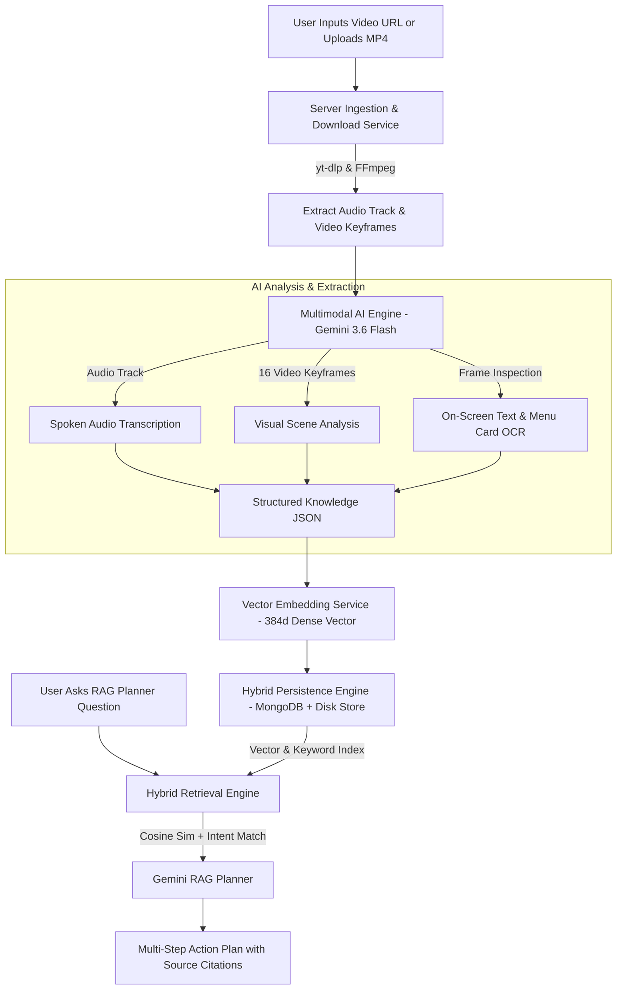

# ReelToReal — System Architecture & Complete Workflow Breakdown

**ReelToReal** is an end-to-end multimodal AI application that transforms unstructured short videos (Instagram Reels, YouTube Shorts, and uploaded MP4s) into structured, queryable personal memories and actionable multi-step plans.

---

## 📐 Overall System Workflow Architecture



---

## 🎬 1. Video Ingestion & Download Workflow (`urlDownloadService.js`)

When a user submits an Instagram Reel or YouTube Shorts URL:

1. **URL Validation**: The backend checks and normalizes the public URL.
2. **Stream Download (`yt-dlp`)**: 
   * Downloads using format string `bestvideo+bestaudio/best`.
   * Prevents 0-audio stream issues common in YouTube Shorts.
3. **Stream Merging (`ffmpeg-static`)**:
   * Merges separate audio and video streams into a clean, standalone MP4 file saved in `server/uploads/`.
4. **File Uploads**: Direct MP4/MOV file uploads via `multer` are stored directly in `server/uploads/`.

---

## 🎞️ 2. Audio & Video Frame Processing (`understandingService.js`)

Once the MP4 file is available on disk, **FFmpeg** performs keyframe and audio extraction:

```
┌─────────────────────────────────────────────────────────────────────────┐
│                           Input MP4 Video                               │
└────────────────────────────────────┬────────────────────────────────────┘
                                     │
                 ┌───────────────────┴───────────────────┐
                 ▼                                       ▼
    [16 Keyframe Snapshots]                    [Audio MP3 Track]
    • fps=1/1.5, scale=768:-2                  • 16kHz Mono MP3
    • Distributed across whole video            • 64kbps bit-rate
                 │                                       │
                 ▼                                       ▼
   Save 6 Gallery Snapshots                     Base64 Audio Buffer
  (/uploads/gallery-xxx.jpg)
```

1. **Keyframe Extraction**:
   * FFmpeg samples up to 16 keyframe snapshots distributed evenly across the video.
   * Scales images to `768px` width to optimize AI token usage while preserving menu text readability.
2. **Keyframe Photo Gallery**:
   * Saves up to 6 gallery frames into `/uploads/gallery-...jpg` for the frontend detail page gallery.
3. **Audio Extraction**:
   * Extracts audio track into a 16kHz mono MP3 (`audio.mp3`) for AI transcription.

---

## 🧠 3. Multimodal AI & Menu OCR Engine (`understandingService.js`)

ReelToReal uses **Google Gemini 3.6 Flash** (`@google/genai`) to process audio and visual frames together in a single multimodal request:

### Payload Sent to Gemini:
* **Text Instructions**: Demands strict structured JSON output containing title, summary, transcript, visual analysis, on-screen text/menu OCR, category, subcategory, entities, locations, foods, products, activities, price, and actionable ideas.
* **Inline Audio Track**: Base64-encoded `audio/mp3` buffer.
* **Inline Keyframes**: Array of base64-encoded `image/jpeg` frame buffers.

```json
{
  "title": "Grand Dragon Chinese Restaurant",
  "summary": "Authentic Cantonese dim sum and hand-pulled Dan Dan noodles.",
  "transcript": "Welcome to Grand Dragon! Today we are trying their famous Dan Dan noodles.",
  "visualAnalysis": "Chef pulling fresh noodles, steaming bamboo dim sum baskets.",
  "onScreenText": "Menu Card: Dan Dan Noodles ₹380, Peking Duck ₹1200",
  "category": "Food",
  "subcategory": "Chinese Restaurant",
  "tags": ["chinesefood", "dimsum", "pekingduck"],
  "entities": [{"name": "Grand Dragon", "type": "restaurant"}],
  "locations": ["Downtown Chinatown"],
  "foods": ["Dan Dan Noodles", "Peking Duck"],
  "price": "$$",
  "actionableIdeas": ["Try the signature Dan Dan noodles"]
}
```

---

## ⚡ 4. Vector Embedding & RAG Engine (`embeddingService.js` & `plannerService.js`)

To enable instant natural language search and itinerary planning over saved reels:

### A. Embedding Generation
* Combines title, summary, transcript, visual analysis, menu OCR text, tags, locations, foods, and activities into a single text document.
* Computes a **384-dimensional dense vector embedding** using character n-gram TF-IDF and hashing.

### B. Hybrid RAG Retrieval Strategy
When a user asks: *"Plan a Saturday dinner for 2 people with Chinese food in Chennai under ₹1500"*:

1. **User Intent Classification**: Detects intent (`Food`, `Travel`, `Recipe`, `Fitness`).
2. **Dense Vector Cosine Similarity**: Measures mathematical similarity between the prompt query embedding vector and stored video memory vectors:
   $$\text{Cosine Similarity} = \frac{\mathbf{A} \cdot \mathbf{B}}{\|\mathbf{A}\| \|\mathbf{B}\|}$$
3. **Keyword Frequency Scoring**: Gives extra weight to matching entity names, cities, dishes, and categories.
4. **Context Injection**: Top 3 most relevant video memories are formatted into a RAG context prompt.
5. **AI Plan Generation**: Gemini synthesizes a multi-step structured plan complete with timing, estimated costs, and **source citations**.

---

## 💾 5. Dual Persistence Engine (`videoStore.js` & `userStore.js`)

To guarantee data is never lost when refreshing the page (`F5`) or restarting the dev server:

```
                            ┌───────────────────┐
                            │   API Controller  │
                            └─────────┬─────────┘
                                      │
                         ┌────────────┴────────────┐
                         ▼                         ▼
               MongoDB Connected?           MongoDB Down/Offline?
                (Mongoose Models)           (JSON Disk Persistence)
                         │                         │
                         ▼                         ▼
                  MongoDB Atlas              server/data/store.json
                                             server/data/users.json
```

* **Hybrid ID Resolver**: Handles both 24-character MongoDB `ObjectIds` and string IDs (`local-1`, `legacy-...`) seamlessly.
* **Automatic Seed Memories**: Pre-populates default demo video memories if local disk store is fresh.

---

## 👤 6. Authentication & Frontend UI (`client/src/`)

* **User Authentication (`auth.js` / `Login.jsx`)**:
  * Accounts stored in MongoDB / disk (`users.json`).
  * Supports Sign-In, Account Creation, and **1-Click Demo Login (`Lakshita Anbalagan`)**.
  * Stores user token in `localStorage` and updates header profile navigation pill in real-time.
* **Pages**:
  * `/` (**Home**): Hero introduction & workflow explanation.
  * `/login` (**Login**): Sign-In, Register, and Demo login.
  * `/add` (**Add Reel**): Process public reel URLs or upload MP4 files.
  * `/process/:id` (**Processing**): Real-time AI extraction status tracker.
  * `/library` (**Library**): Filterable video memory grid.
  * `/library/:id` (**Detail**): Displays Extracted Keyframes Photo Gallery, Menu Card OCR Box, Audio Transcript, and Actionable Recommendations.
  * `/plan` (**Planner**): RAG natural language AI planner with source memory citations.
